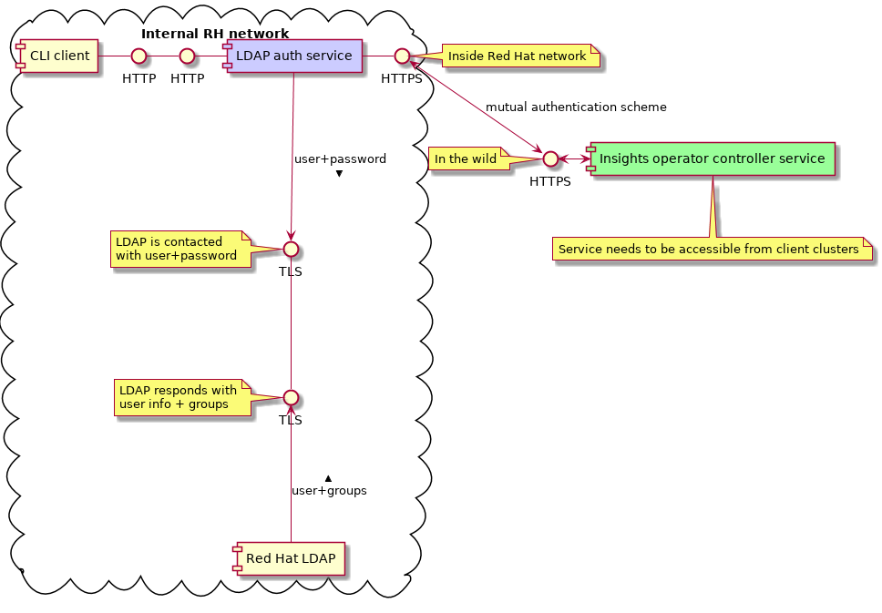
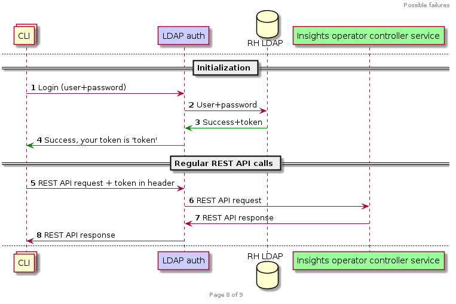

# Insights operator LDAP Auth

[](https://godoc.org/github.com/RedHatInsights/insights-operator-ldapauth)
[](https://redhatinsights.github.io/insights-operator-ldapauth/)
[](https://goreportcard.com/report/github.com/RedHatInsights/insights-operator-ldapauth)
[](https://travis-ci.org/RedHatInsights/insights-operator-ldapauth)
[](https://codecov.io/gh/RedHatInsights/insights-operator-ldapauth)
[](https://github.com/RedHatInsights/insights-operator-ldapauth/blob/master/LICENSE)

## Overview

The whole system consists of several components: CLI client, LDAP Auth service, and the Insights operator instrumentation service:



### Authorization part


### Authorization sequence diagram for known user with proper token



### Authorization sequence diagram in case of any error


## Starting

By default application starting on port `8081`, but it can be changed in configuration file `config.toml`.

```Bash
go build # Build application
./insights-operator-ldapauth # Start application
```

Alternatively you can use *GNU make* to perform the same operation:

```
make run
```

## Authentication

For authentication is used POST request to `/api/v1/login` with credentials:
```JSON
{
	"login": "your-ldap-login",
	"password": "your-ldap-password"
}
```

For now it connecting directly to RedHat LDAP, so for running this application correctly you should be connected to RedHat VPN. After you recieve `token`, you can use it in requests as `Bearer Token`.

## RestAPI

Application has only one route is `/api/v1/login`, requests to other routes will be proxied to `insights-operator-controller`.

## Code style and cyclomatic complexity checks

All code style checks, cyclomatic complexity measurement etc. can be started from command line by using:

```
make style
```

## Configuration

Change the following lines in `config.toml`:

```
[service]
ldap="ldap.corp.redhat.com"
address=":8081"
proxy="http://localhost:8080"
proxy_prefix="/api/v1/"
proxy_tls=true
tls_cert="certs/cert.pem"
tls_key="certs/key.pem"
```

 - `ldap` is hostname of LDAP server
 - `address` is address of ldapauth server
 - `proxy` is address of controller server
 - `proxy_prefix` is prefix of controller server which will be replaced instead of ldapauth prefix
 - `proxy_tls` is boolean flag that defines if proxy connection with controller should secured by mutual TLS
 - `tls_cert` is path to certificate, can be used only if `proxy_tls == true`
 - `tls_key` is path to key of certificate, can be used only if `proxy_tls == true`

### Environment variables

Some settings can be setted with environment variables:

 - `CONTROLLER_PREFIX` - specify URL path prefix (Default: `/api/v1/`)
 - `INSIGHTS_CONTROLLER_CONFIG_FILE` - custom path to config file (default: `./config.toml`)

## CI

[Travis CI](https://travis-ci.com/) is configured for this repository. Several tests and checks are started for all pull requests:

* Unit tests that use the standard tool `go test`
* `go fmt` tool to check code formatting. That tool is run with `-s` flag to perform [following transformations](https://golang.org/cmd/gofmt/#hdr-The_simplify_command)
* `go vet` to report likely mistakes in source code, for example suspicious constructs, such as Printf calls whose arguments do not align with the format string.
* `golint` as a linter for all Go sources stored in this repository
* `gocyclo` to report all functions and methods with too high cyclomatic complexity. The cyclomatic complexity of a function is calculated according to the following rules: 1 is the base complexity of a function +1 for each 'if', 'for', 'case', '&&' or '||' Go Report Card warns on functions with cyclomatic complexity > 9

History of checks done by CI is available at [RedHatInsights / insights-operator-ldapauth](https://travis-ci.org/RedHatInsights/insights-operator-ldapauth).


## Contribution

Please look into document [CONTRIBUTING.md](CONTRIBUTING.md) that contains all information about how to contribute to this project.
